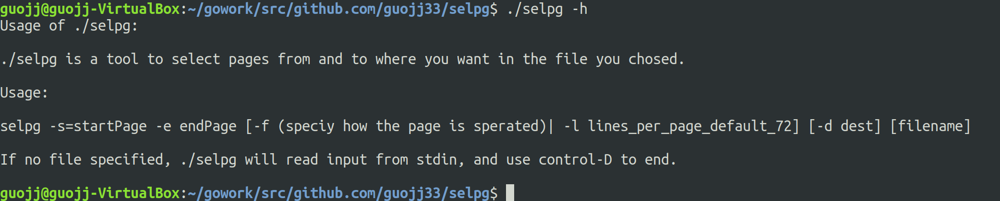
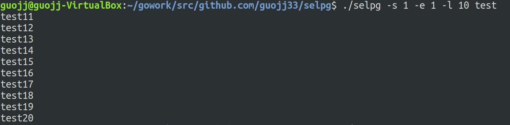
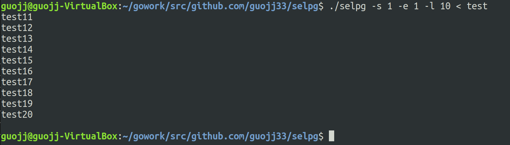
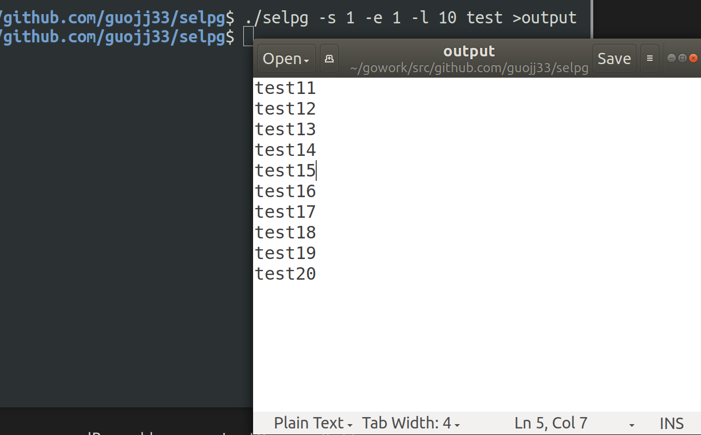
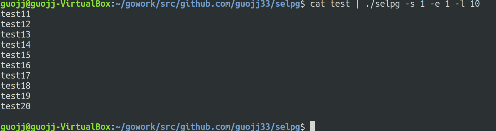
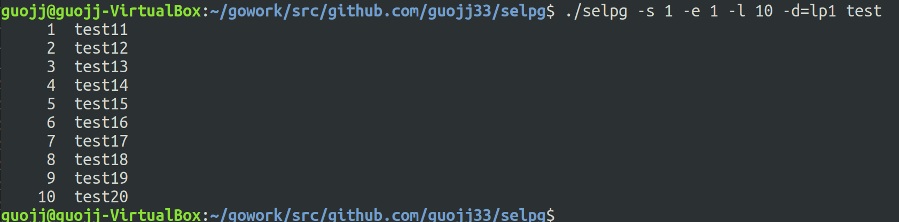

## CLI 命令行实用程序开发基础

### 实验环境

- Ubuntu
- go

### 程序说明

- 参数说明  
```go
type selpgArgs struct {
	startPage int           //起始页码
	endPage int             //结束页码
	pageLen int		        //每页行数，默认为 72
	formDeli bool	        //是否规定页面以 \f 结尾，默认为否，与 pageLen 为互斥选项
	inputFile string	    //输入文件，非flag命令行参数
	destination string	    //打印目的地
}
```

- 使用方法  
参数可以用等号赋值也可以仅用空格隔开  
```
/selpg $ go build
/selpg $ selpg -s startPage -e endPage [-f (speciy how the page is sperated)| -l lines_per_page_default_72] [-d dest] [filename]
```

### 测试结果

#### 1. help


#### 2. 将第 2 页输出至标准输出（屏幕）


#### 3. 将第 2 页输出（重定向标准输入）
selpg 读取标准输入，而标准输入已被 shell／内核重定向为来自 test 而不是显式命名的文件名参数。  


#### 4. 将第 2 页输出（重定向标准输出）


#### 5. 将第 2 页输出（将其他程序得标准输出作为标准输入）
cat test 的标准输出被 shell／内核重定向至 selpg 的标准输入。  


#### 6. 将第 2 页输出在打印机 lp1 上打印
