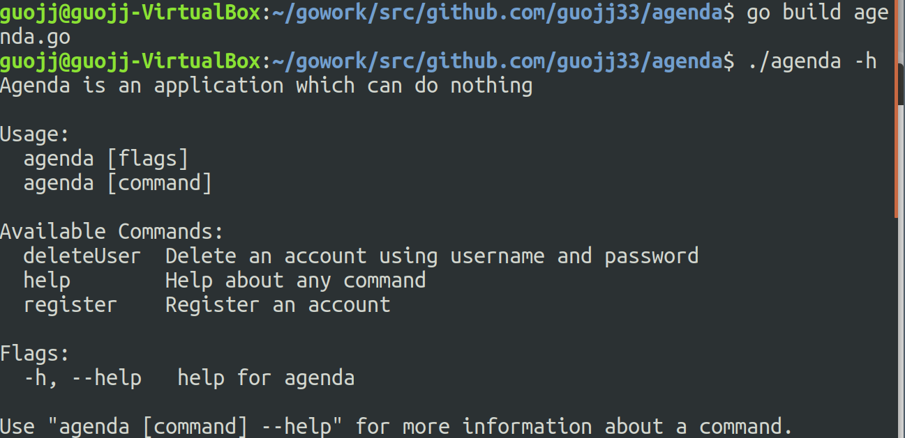
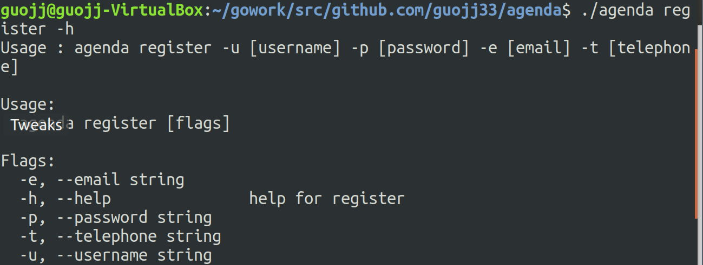
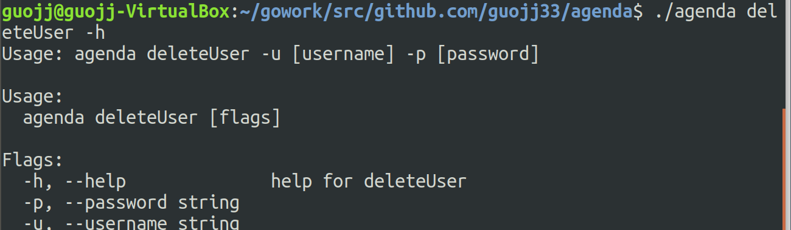
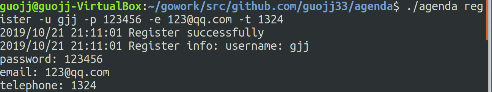
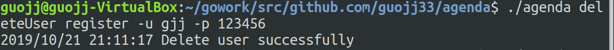
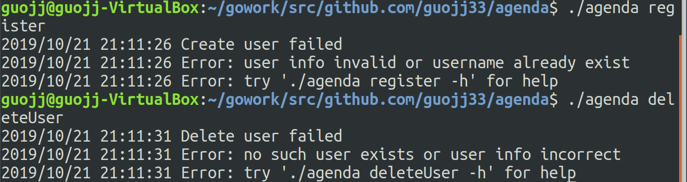

## CLI 命令行实用程序开发实战 - Agenda

### 实验环境

- ubuntu
- go

### 实验内容

实现 agenda 的两条指令

- 注册用户
- 删除用户

实现需求

- 持久化
- 日志服务

### 文件目录说明

- agenda/cmd    存放命令实现代码
- agenda/entity 存放 user 对象读写与处理逻辑
- agenda/data   存放 user 用户数据


### go-online 项目分享连接
[传送门](http://139.9.57.167:20080/share/bmmrg4m76kvs669u22d0?secret=false)

### 实验过程

#### 1. 使用 cobra 初始化 agenda 程序

- cobra 安装
    创建并 cd 到目录 ``$GOPATH/src/golang.org/x``  
    在此目录下执行：
    ```
    git clone https://github.com/golang/text
    git clone https://github.com/golang/sys
    ```
    执行：
    ```
    go get -v github.com/spf13/cobra/cobra
    go install github.com/spf13/cobra/cobra
    ```
    完成安装

- cobra 使用
    在想要创建 agenda 的目录下执行
    ```
    cobra init agneda --pkg-name .
    ```
    其中 ``--pkg-name``设置为``.``  
    会使生成的``main.go`` 中import 路径变成`.`  
    可以稍后改成绝对路径  
    ```go
    //main.go
    package main

    import "./cmd"

    func main() {
    cmd.Execute()
    }
    ```

#### 2. 指令实现
两条指令的实现逻辑很简单，主要是熟悉添加命令的方法
- 创建账户
    前提是用户名不重复，用户信息值非空
    ```go
    //storage.go
    func CreateUser(name, password, mail, telephone string) bool {
        if name == "" || password == "" || mail == "" || telephone == "" {
            return false	
        }
        user := User{
            Username:  name,
            Password:  password,
            Mail:      mail,
            Telephone: telephone,
        }
        if isUserUnique(user) {
            allUsers = append(allUsers, user)
            UpdateLib()
            return true	
        } else {
            return false
        }
    } 
    ```

- 删除账户
    前提是账户存在，并且输入的密码正确
    ```go
    //storage.go
    func DeleteUser(username, password string) bool {
        for i, useri := range allUsers {
            if useri.Username == username && useri.Password == password {
                allUsers[i] = allUsers[len(allUsers)-1]
                allUsers    = allUsers[0:len(allUsers)-1]
                UpdateLib()
                return true
            }
        }
        return false
    }
    ```

#### 3. 程序测试

- 编译运行
    
- 帮助信息
    
    
- 注册用户
    
- 删除用户
    
- 出错时的帮助信息
    