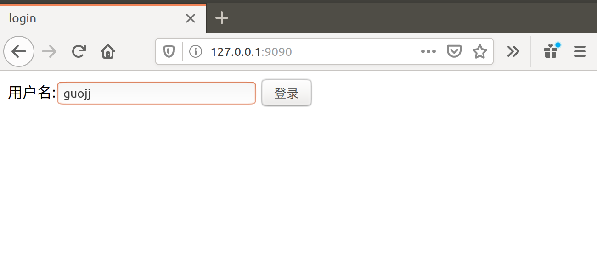

## 简单 web 服务程序 cloudgo

### 实验环境

- ubuntu
- go

### 实验内容

1. 熟悉 go 服务器工作原理
2. 基于现有 web 库，编写一个简单 web 应用类似 cloudgo。
3. 使用 curl 工具访问 web 程序
4. 对 web 执行压力测试

### go-online 项目分享连接
[传送门]()

### 实现内容

1. 运行 go run main.go 启动服务器  
2. 登录 http://localhost:9090/ 进入登陆界面  
    
3. 输入用户名后登录，进入游戏选择界面  
    
4. 两个游戏链接指向静态 html 文件（之前 web 课的作业）  
      
    


#### 实验过程

- 因为只是简单的 web 应用，所以选择用轻量级组件而没有使用框架，主要使用的库：
  - github.com/gorilla/mux
  - github.com/unrolled/render
  - github.com/urfave/negroni

#### 程序测试
- curl 工具访问 web 程序
    ```
    $ curl -v http://localhost:9090/
    *   Trying 127.0.0.1...
    * TCP_NODELAY set
    * Connected to localhost (127.0.0.1) port 9090 (#0)
    > GET / HTTP/1.1
    > Host: localhost:9090
    > User-Agent: curl/7.58.0> Accept: */*
    > 
    < HTTP/1.1 200 OK
    < Content-Type: text/html; charset=UTF-8
    < Date: Tue, 12 Nov 2019 17:17:56 GMT
    < Content-Length: 240
    < 
    <html><head>
        <title>login</title>
    </head>
        <body>
            <form action="/" method="post">
                用户名:<input type="text" name="username">
                <input type="submit" value="登录">
            </form>
        </body>
    * Connection #0 to host localhost left intact
    ```

- ab 压力测试
    ab 命令参数
    ```
    -n 执行的请求数量
    -c 并发请求个数
    ```
    ```
    $ ab -n 1000 -c 100 http://localhost:9090/
    This is ApacheBench, Version 2.3 <$Revision: 1807734 $>
    Copyright 1996 Adam Twiss, Zeus Technology Ltd, http://www.zeustech.net/
    Licensed to The Apache Software Foundation, http://www.apache.org/

    Benchmarking localhost (be patient)
    Completed 100 requests
    Completed 200 requests                                                      ### 目前共完成了 200 个请求
    Completed 300 requests
    Completed 400 requests
    Completed 500 requests
    Completed 600 requests
    Completed 700 requests
    Completed 800 requests
    Completed 900 requests
    Completed 1000 requests
    Finished 1000 requests                          ### 目前共完成所有 1000 个请求


    Server Software:        
    Server Hostname:        localhost               ### 服务器主机名（域名）
    Server Port:            9090                    ### 服务器端口号

    Document Path:          /                       ### 请求的资源
    Document Length:        240 bytes               ### 文档返回的长度（不包括 header 头信息）

    Concurrency Level:      100                     ### 并发个数
    Time taken for tests:   0.333 seconds           ### 总请求时间
    Complete requests:      1000                    ### 总请求数
    Failed requests:        0                       ### 失败的请求书
    Total transferred:      357000 bytes            ### 请求总数据大小（包括 header 头信息）
    HTML transferred:       240000 bytes            ### html 页面实际总字节数
    Requests per second:    3004.77 [#/sec] (mean)  ### 平均每秒请求书
    Time per request:       33.280 [ms] (mean)      ### 平均每个请求消耗的时间
    Time per request:       0.333 [ms] (mean, across all concurrent requests)   ### 上面的时间 除以 并发数
    Transfer rate:          1047.56 [Kbytes/sec] received                       ### 传输速率

    Connection Times (ms)
                min  mean[+/-sd] median   max
    Connect:        0    1   1.2      0       6
    Processing:     0   30  21.1     23     102
    Waiting:        0   29  21.0     23     102
    Total:          0   31  21.0     24     102

    Percentage of the requests served within a certain time (ms)
    50%     24                                      ### 50% 的请求在 24 ms 内返回
    66%     38
    75%     51
    80%     54
    90%     62
    95%     67
    98%     69
    99%     70                                      ### 99% 的请求在 70 ms 内返回
    100%    102 (longest request)
    ```